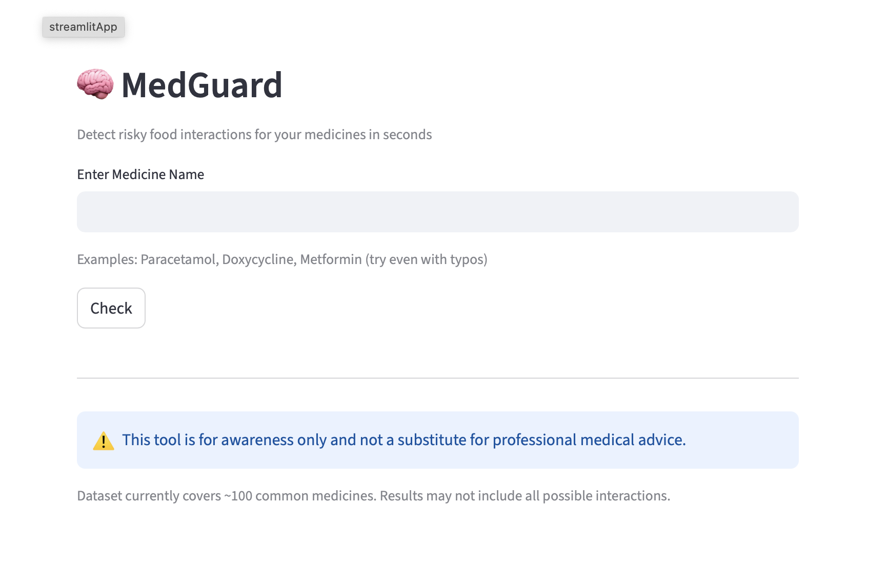
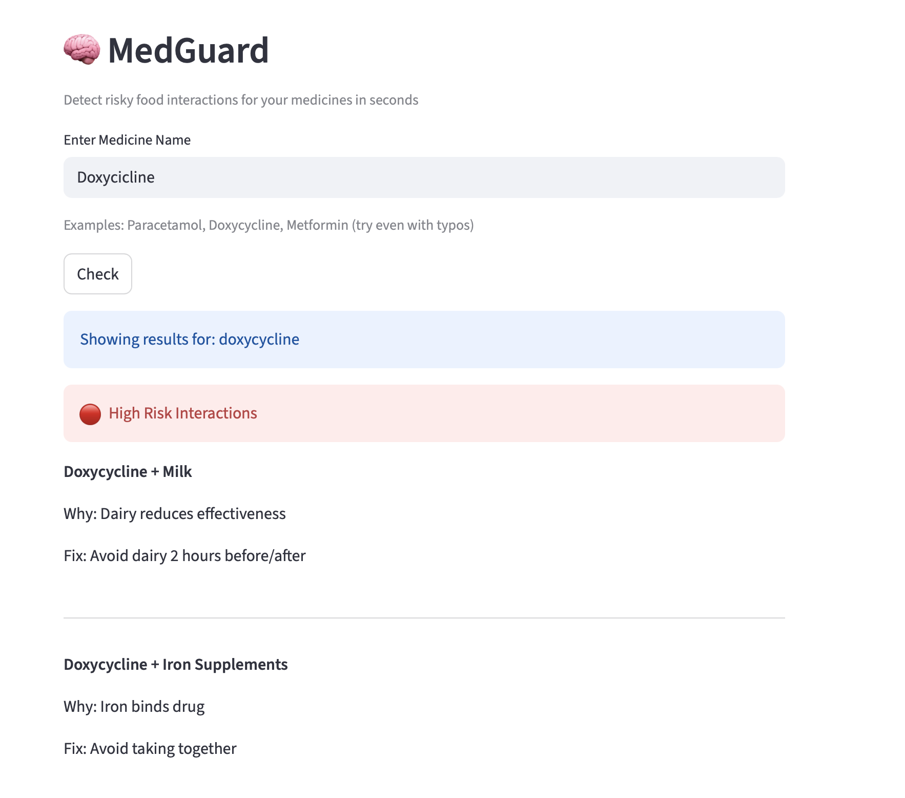

# MedGuard AI

A decision-support system that detects risky medicine + food interactions and provides actionable recommendations.

## 🚨 Problem
Most people take medicines without understanding how their daily habits (like food) affect effectiveness.

## 💡 Solution
MedGuard AI identifies harmful interactions and suggests safer alternatives.

## ⚙️ Features
- Drug–food interaction detection
- Severity-based risk classification
- Actionable recommendations

## 📊 Dataset
Custom-built dataset of medicine–food interactions from real medical sources.

## 🛠️ Tech Stack
- Python
- Pandas
- Streamlit

## 🚀 Future Work
- Risk scoring model
- User habit simulation

## 🖥️ App Preview

### Home Screen

### Example Result

## 🚀 Live Demo
[Try MedGuard AI](https://medguard29.streamlit.app)
